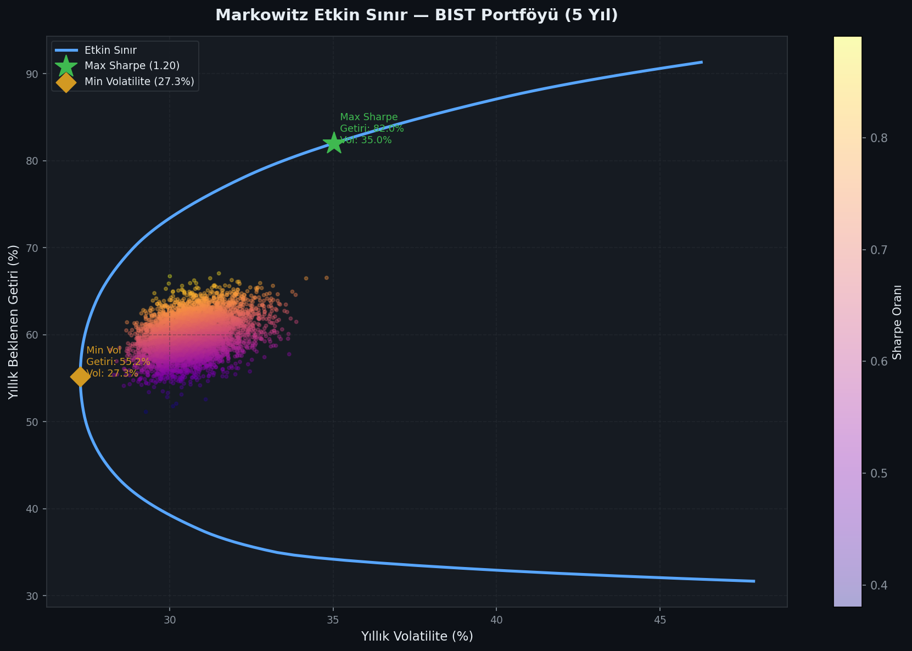
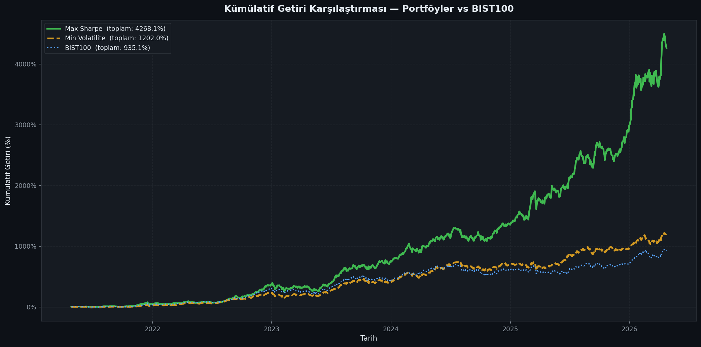
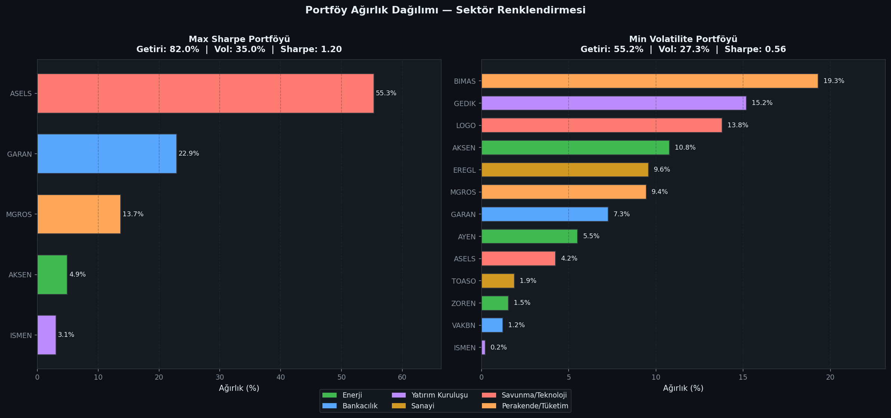
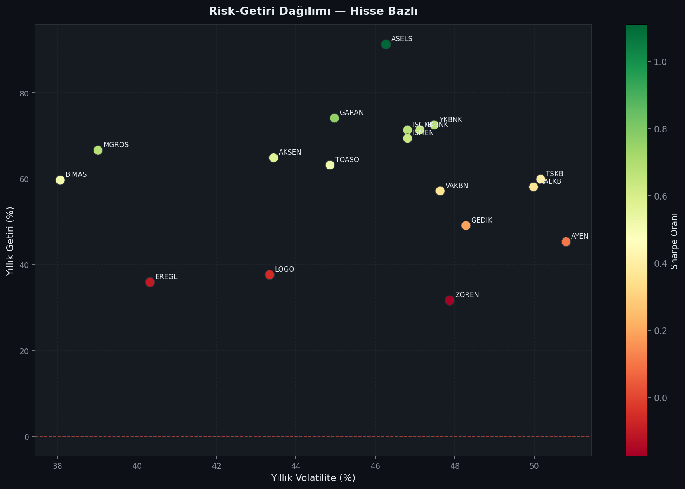
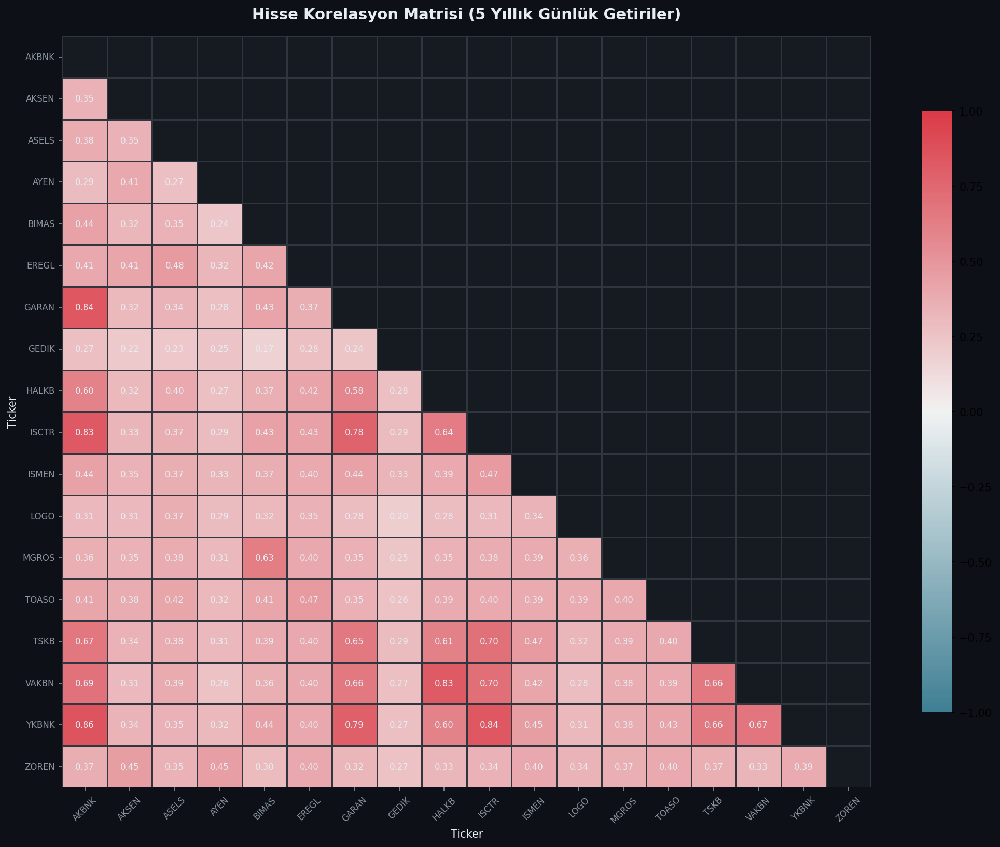

# BIST Portföy Optimizasyonu & Risk Analizi

> **Modern Portföy Teorisi** çerçevesinde 19 BIST hissesine ait 5 yıllık veri üzerinden Markowitz optimizasyonu, etkin sınır analizi ve kapsamlı risk metrikleri hesaplayan Python projesi.

---

## İçindekiler
- [Proje Hakkında](#proje-hakkında)
- [Metodoloji](#metodoloji)
- [Kurulum](#kurulum)
- [Kullanım](#kullanım)
- [Sonuçlar](#sonuçlar)
- [Dosya Yapısı](#dosya-yapısı)
- [Kaynaklar](#kaynaklar)

---

## Proje Hakkında

Bu proje, **Borsa İstanbul (BIST)** hisselerinden oluşan çok varlıklı bir portföy üzerinde:

- **Markowitz Ortalama-Varyans Optimizasyonu** ile maksimum Sharpe ve minimum volatilite portföylerini bulur
- **Monte Carlo simülasyonu** ile 6.000 rastgele portföy üreterek etkin sınırı görselleştirir
- **VaR / CVaR** (tarihsel yöntem, %95 güven düzeyi) ile kuyruk riskini ölçer
- **Beta** hesabıyla portföylerin BIST100 endeksine duyarlılığını değerlendirir
- Tüm sonuçları yatırım alanında kullanılan standart görsellerle sunar

### Hisse Evreni

| Sektör | Hisseler |
|--------|---------|
| Enerji | AKSEN, ZOREN, AYEN, EUPWR |
| Bankacılık | GARAN, ISCTR, AKBNK, YKBNK, HALKB, VAKBN, TSKB |
| Yatırım Kuruluşu | ISMEN, GEDIK |
| Sanayi | EREGL, TOASO |
| Savunma / Teknoloji | ASELS, LOGO |
| Perakende / Tüketim | BIMAS, MGROS |

---

## Metodoloji

### 1. Veri
- Kaynak: `yfinance` API — Yahoo Finance
- Periyot: 5 yıllık günlük kapanış fiyatları
- Getiri: Günlük yüzde değişim `(P_t / P_{t-1}) - 1`
- Eksik veri eşiği: >%20 eksik olan hisse evrenden çıkarılır

### 2. Portföy Optimizasyonu
**Hedef fonksiyonlar:**

| Portföy | Hedef |
|---------|-------|
| Max Sharpe | `max (μ_p - r_f) / σ_p` |
| Min Volatilite | `min σ_p` |

**Kısıtlar:**
- `Σ w_i = 1` (tam yatırım)
- `0 ≤ w_i ≤ 1` (açığa satış yok)
- Risk-free rate: ~%40 (TCMB politika faizi yaklaşımı)

**Yıllıklaştırma:** 252 işlem günü baz alınmıştır.

### 3. Risk Metrikleri

**VaR (Value at Risk — Tarihsel):**
$$\text{VaR}_{95} = -Q_{0.05}(r_{portföy})$$

**CVaR (Conditional VaR / Expected Shortfall):**
$$\text{CVaR}_{95} = -\mathbb{E}[r \mid r \leq \text{VaR}_{95}]$$

**Beta:**
$$\beta = \frac{\text{Cov}(r_p,\ r_{BIST100})}{\text{Var}(r_{BIST100})}$$

### 4. Görselleştirmeler

| Grafik | Açıklama |
|--------|----------|
| `correlation_heatmap.png` | Alt-üçgen korelasyon ısı haritası |
| `efficient_frontier.png` | Etkin sınır + Monte Carlo bulut + optimum noktalar |
| `portfolio_weights.png` | Max Sharpe ve Min Vol ağırlıkları, sektör renklendirmesi |
| `cumulative_returns.png` | Her iki portföy vs BIST100 kümülatif getiri |
| `risk_return_scatter.png` | Hisse bazlı risk-getiri dağılımı (Sharpe renklendirmesi) |

### Etkin Sınır


### Kümülatif Getiri


### Portföy Ağırlıkları


### Risk-Getiri Dağılımı


### Korelasyon Matrisi


---

## Kurulum

```bash
git clone https://github.com/Alihanarr/bist-portfolio-optimization.git
cd bist-portfolio-optimization

python -m venv venv
source venv/bin/activate        # Windows: venv\Scripts\activate

pip install -r requirements.txt
```

---

## Kullanım

```bash
# Tüm analizi çalıştır (veri indir + optimize et + grafikleri kaydet)
python analysis.py
```

İlk çalıştırmada veriler `data/prices_raw.parquet` olarak önbelleğe alınır; sonraki çalıştırmalar internete bağlı olmadan çalışır.

**Jupyter Notebook olarak kullanmak için:**
```bash
jupyter notebook
# notebooks/analysis.ipynb dosyasını aç
```

---

## Sonuçlar

*`python analysis.py` çalıştırıldıktan sonra aşağıdaki örnek değerler güncellenir.*

| Metrik | Max Sharpe | Min Volatilite |
|--------|-----------|----------------|
| Yıllık Getiri | %82.0 | %55.2 |
| Yıllık Volatilite | %35.0 | %27.3 |
| Sharpe Oranı | 1.20 | 0.56 |
| VaR %95 (günlük) | %-4.51 | %-2.41 |
| CVaR %95 (günlük) | %-5.40 | %-3.77 |
| Beta (BIST100) | 0.999 | 0.846 |

**En yüksek ağırlıklı hisseler:**
- Max Sharpe: ASELS (%55.3), GARAN (%22.9), MGROS (%13.7)
- Min Volatilite: BIMAS (%19.3), GEDIK (%15.2), LOGO (%13.8)

*Veri aralığı: 2021-04-27 → 2026-04-24 | 18 hisse | 5 yıl*

> Sonuçlar piyasa koşullarına göre değişkenlik gösterir. Geçmiş performans gelecek getiriyi garanti etmez.

---

## Dosya Yapısı

```
bist-portfolio-optimization/
│
├── src/
│   ├── data_loader.py     # Veri çekme, temizleme, temel istatistikler
│   ├── portfolio.py       # Markowitz optimizasyonu, VaR/CVaR, Beta
│   └── visualize.py       # Tüm görselleştirme fonksiyonları
│
├── data/
│   └── prices_raw.parquet # Önbelleklenmiş fiyat verisi (gitignore'da)
│
├── outputs/               # Üretilen grafikler
│   ├── correlation_heatmap.png
│   ├── efficient_frontier.png
│   ├── portfolio_weights.png
│   ├── cumulative_returns.png
│   └── risk_return_scatter.png
│
├── notebooks/
│   └── analysis.ipynb     # Etkileşimli Jupyter versiyonu
│
├── analysis.py            # Ana çalıştırma scripti
├── requirements.txt
└── README.md
```

---

## Kaynaklar

- Markowitz, H. (1952). *Portfolio Selection*. The Journal of Finance.
- [Modern Portfolio Theory — Investopedia](https://www.investopedia.com/terms/m/modernportfoliotheory.asp)
- [yfinance Documentation](https://ranaroussi.github.io/yfinance/)
- [SciPy Optimization](https://docs.scipy.org/doc/scipy/reference/optimize.html)

---

*Bu proje eğitim amaçlıdır; yatırım tavsiyesi niteliği taşımaz.*
